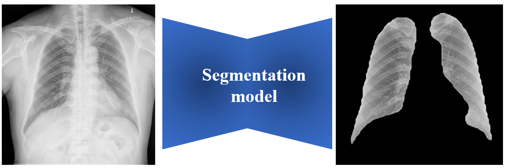

# Lung-Segmentation-with-fastai-and-pytorch
This repository contains different implementations of deep learning models for the segmentation of the lung region in chest x-ray images using pytorch and fastai.

## Dataset
To train and evaluate the segmentation models, a custom dataset was built from the mixture of the Montgonery data set and 200 images of patients infected with COVID-19 whose segmentation masks were obtained manually by radiologists. The dataset contains 1520 images with a resolution of 128x128 and  their respective masks.

## Requirements
1. opencv-python
2. fastcore
3. fastai
4. torchviz
5. Pillow
6. numpy
7. graphviz
8. torch
9. gradio
10. python = 3.7.9

## Models
Various segmentation models of the lung region are provided in this repository. Each model is implemented in the jupyter notebook [training_experiments.ipynb](training_experiments.ipynb), and a brief description of each is provided in the ["models.txt"](models.txt.txt) file. 

## Try the models
All the models have been disployed in a hugging face spaces interface [here](https://huggingface.co/spaces/ErnestoST5/Lung_segmentation_base_line_1).

## Contributions
Contributions are welcome. If you'd like to contribute to this project, please open an issue first to discuss any major changes you'd like to make. You can also run the models locally by running the app.py script. You can also run the models locally by running the app.py script. Remember to pre-download the model you want to test and change the value of the path_model variable in the [app.py](app.py) script.

## License
This project is licensed under the Apache 2.0 License. See the [LICENSE](LICENSE) file for more details.

