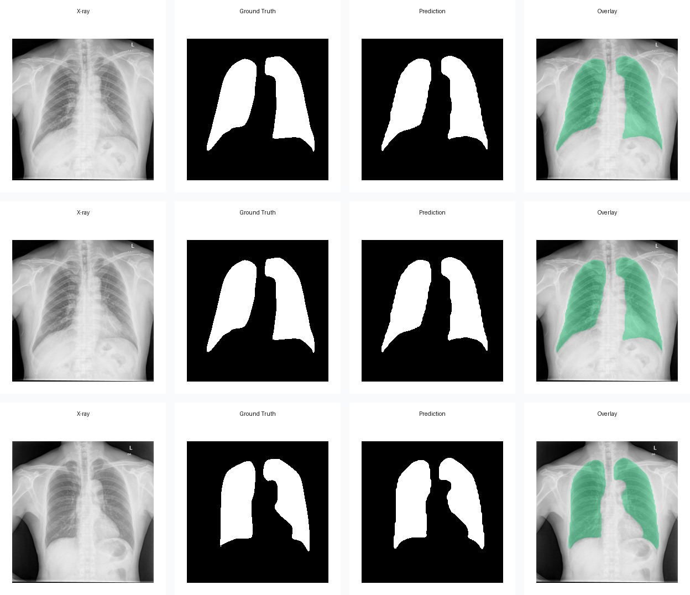

# Lung Segmentation with fastai and PyTorch

Reproducible research pipeline for lung field segmentation in chest X-ray images.
The project trains and evaluates U-Net models with fastai/PyTorch and provides a
Gradio interface for model inspection.



## Research Positioning

This repository is an educational and research-oriented implementation. It is
not a medical device and must not be used for diagnosis, treatment, triage, or
clinical decision making.

The project is organized to make experiments traceable:

- manifest-based dataset definition
- fixed train/validation/test split
- Dice and IoU as primary segmentation metrics
- pixel accuracy as a secondary metric
- model artifacts kept outside Git history
- command line workflows for training, evaluation, prediction, and app launch

Relevant reporting references:
[CLAIM](https://www.equator-network.org/reporting-guidelines/checklist-for-artificial-intelligence-in-medical-imaging-claim-a-guide-for-authors-and-reviewers/),
[TRIPOD+AI](https://www.bmj.com/content/385/bmj.q902),
[FDA GMLP](https://www.fda.gov/medical-devices/software-medical-device-samd/good-machine-learning-practice-medical-device-development-guiding-principles),
and [Model Cards](https://huggingface.co/docs/hub/model-cards).

## Repository Layout

```text
configs/                  Experiment configs for ResNet18 and ResNet34 U-Nets
data/manifest.csv          Dataset manifest schema, without private images
docs/                      Dataset, protocol, reproducibility, and model docs
notebooks/                 Historical Colab notebook
scripts/                   Utility scripts, including manifest creation
src/lung_segmentation/     Reusable package code
tests/                     Unit and CLI smoke tests
artifacts/                 Local-only model, metric, and prediction outputs
```

## Setup

```powershell
python -m venv .venv
.\.venv\Scripts\Activate.ps1
python -m pip install --upgrade pip
python -m pip install -e ".[dev]"
```

For GPU training, install the PyTorch build that matches your CUDA runtime
before installing this package.

## Data Manifest

The project expects `data/manifest.csv` with these columns:

```csv
image_path,mask_path,source,patient_id,split
```

Build a manifest from matched image and mask folders:

```powershell
python scripts/build_manifest.py `
  --images data/raw/montgomery/img `
  --masks data/raw/montgomery/msk `
  --source montgomery `
  --out data/manifest.csv
```

If images come from multiple sources, create one manifest per source and merge
the rows while preserving the same columns. The manifest builder writes paths
relative to the repository root when possible to avoid committing machine-local
directory structure. Prefer patient-level splits. If patient identifiers are
unavailable, use image stems and document this limitation in `docs/dataset.md`.

## Commands

Train:

```powershell
lungseg-train --config configs/resnet34.yaml
```

Evaluate:

```powershell
lungseg-evaluate `
  --config configs/resnet34.yaml `
  --checkpoint artifacts/models/resnet34_Dlr.pkl `
  --split test
```

Predict:

```powershell
lungseg-predict `
  --checkpoint artifacts/models/resnet34_Dlr.pkl `
  --image path\to\xray.png `
  --out artifacts/predictions
```

Launch the app:

```powershell
lungseg-app --model-dir artifacts/models
```

The root `app.py` is kept as a compatibility wrapper:

```powershell
python app.py --model-dir artifacts/models
```

## Models And Artifacts

Model weights such as `unet_resnet18_epoch10.pkl` and `resnet34_Dlr.pkl` belong
in `artifacts/models/`. They are intentionally ignored by Git because exported
fastai learners are large and may encode dataset-specific preprocessing.

Evaluation outputs are written to `artifacts/metrics/`, including per-image CSV
metrics and JSON summaries with global and per-source Dice, IoU, and pixel
accuracy.

## Historical Notebook

The original Colab workflow is preserved at
`notebooks/training_experiments.ipynb`. It is now historical context only; the
reproducible path is the package and CLI workflow.

## License

Apache-2.0. See `LICENSE`.
